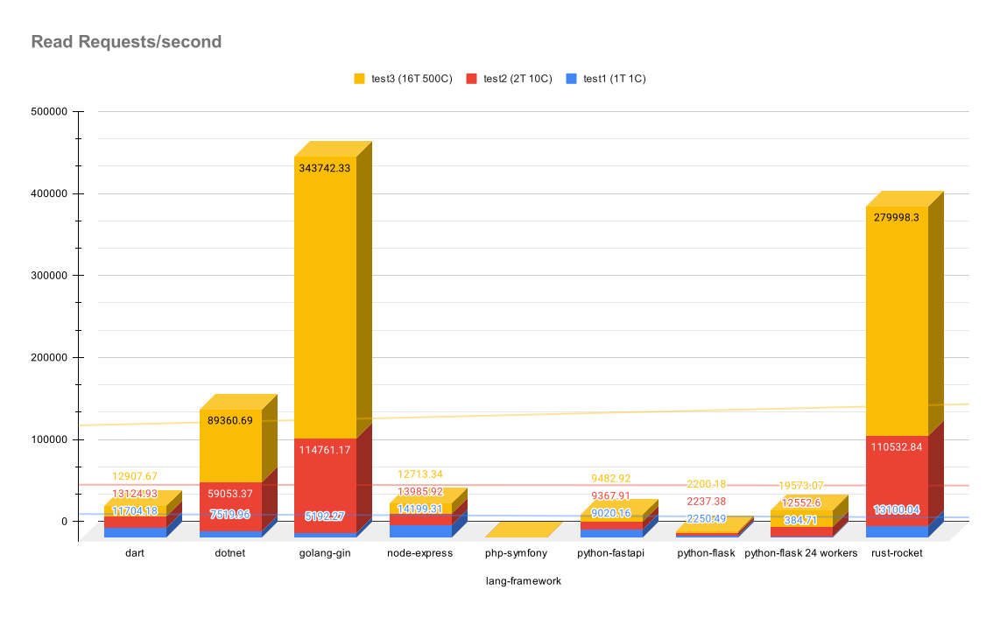

# Project scope

Serve a list of 100 albums with a REST like interface (JSON) and measure the performance with [wrk](https://github.com/wg/wrk)

## Requirements

* server should run on port 8000
* output should be RAW JSON
* albums should be pre-loaded
* benchmark in same machine with minimum apps loaded
  * `wrk -d 20 -t 1 -c 1 http://127.0.0.1:8000/albums`
  * `wrk -d 20 http://127.0.0.1:8000/albums` (2 threads and 10 connections - default)
  * `wrk -d 20 -t 16 -c 500 http://127.0.0.1:8000/albums`

## Benchmark machine specs

* Gigabyte Technology Co., Ltd. B660 GAMING X DDR4
* 12th Gen Intel® Core™ i9-12900K × 24
* 32,0 GiB RAM
* KIOXIA-EXCERIA SSD 1TB
* NVIDIA GeForce RTX 4070 Ti/PCIe/SSE2 / NVIDIA Corporation
* Ubuntu 22.04.2 LTS

Extra information can be found in each mini project folder.

